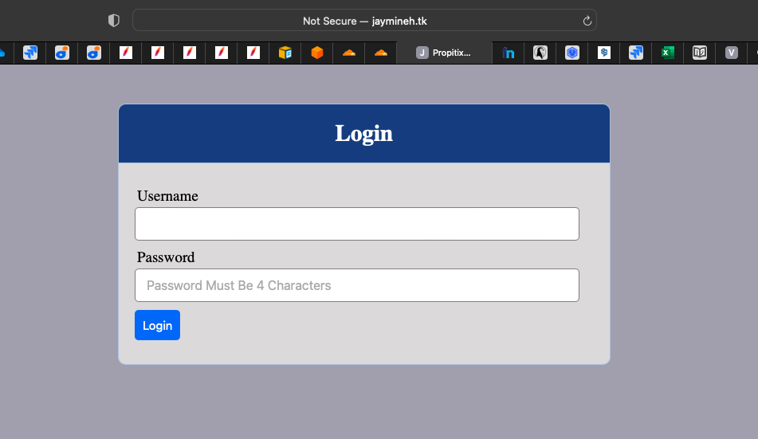
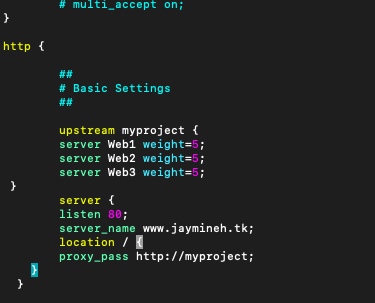
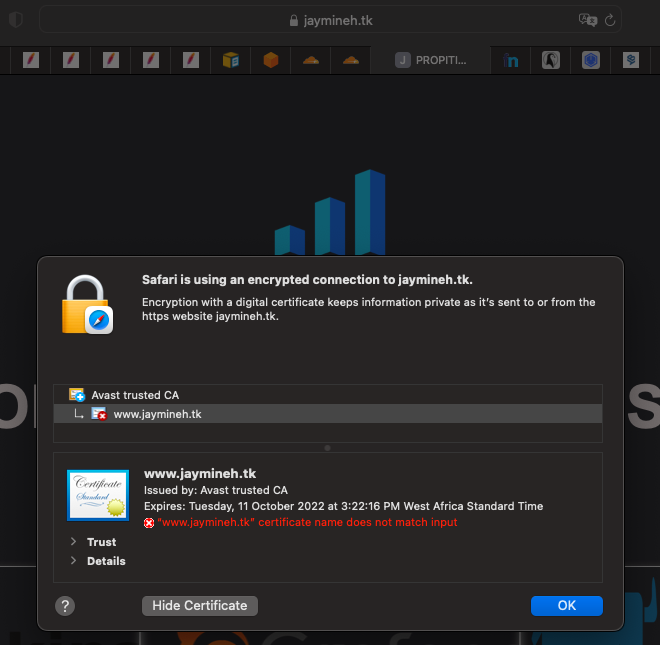
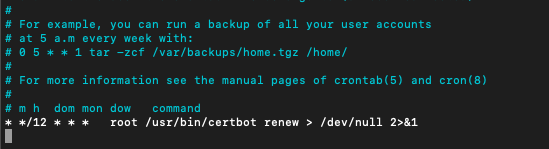
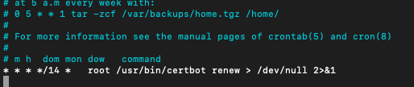

# Project 10 - Load Balancer Solution With NGINX & SSL/TLS

**Step 1 - Configure NGINX As A Load Balancer**
---

- Spin up a new Ubuntu server for the NGINX load balancer. Open up ports 80 and 443 for HTTP & HTTPS traffic.

- Update and upgrade the server.

- Update the `/etc/hosts` file for local DNS with Web Servers’ names (e.g. Web1, Web2 & Web3) and their local IP addresses.

- Install nginx by running `sudo apt install nginx`.

**Step 2 - Configure Local DNS On NGINX**
---

- Run `sudo vi /etc/nginx/nginx.conf` to open the nginx config file to configure the LB using the web server names defined in `/etc/hosts`. See config below:
```
upstream myproject {
    server Web1 weight=5;
    server Web2 weight=5;
    server Web3 weight=5;
  }

server {
    listen 80;
    server_name www.domain.com;
    location / {
      proxy_pass http://myproject;
    }
  }
```
*Note that the above config must be placed in the **http** section*

- Comment out this line `include /etc/nginx/sites-enabled/*;`

- Save the config file and restart nginx. After restarting, check the status of nginx to confirm it is working.

**Step 3 - Register New Domain Name**
---

*Before we register a new domain name, we need to assign a static public IP to our load balancer as that is what will be used to link the domain name so it can be reahed over the internet.*

- Acquire and assign an elastic IP to the load balancer. Since we will be calling the load balancer from the internet, the IP has to be assigned to it and NOT any other machine.

- Go to `http://freenoms.com` and create a free domain name and link it with the elastic IP from AWS. After this, test by putting the domain name in your browser to see if it resolves to the load balancer webpage.



- Update the nginx config file so it recognizes the new domain name by changing the `server_name` field to the newly acquired domain name.



**Step 4 - Configuring Secured Connection Using SSL/TLS Certificates**
---

- Install Certbot. This is what will be used to request an SSL certificate. Run `sudo snap install --classic certbot`. If it doesn't install, enable `snapd` is running as it's the package manager that will be used `sudo systemctl status snapd`.

- Run the commands below and follow the instructions to request the certificate:
```
sudo ln -s /snap/bin/certbot /usr/bin/certbot
sudo certbot --nginx
```

- After the certificate has been provisioned, test the connection by going to the domain name with `https://<domain_name.xxx>`.



**Step 5 - Set Up Periodic Renewal Of The SSL/TLS Certificate**
---

*By default, the SSL certificate lasts around 90 days. It will become a hassle real quick to SSH into the load balancer to renew the certificate manually. To avoid that, we will set up an automated cronjob to do the work for us*

- Run `crontab -e` to open up crontab. Select the preferred editor to open the file.

- Insert the command below to configure the cronjob to run twice a day.
```
* */12 * * *   root /usr/bin/certbot renew > /dev/null 2>&1
```



- You can initiate a certificate renewal manually by running `sudo certbot renew --dry-run`.

*I later modified the cronjob to run every fortnight as I found out that twice a day was a little too much for a certificate that lasts for 90 days*



**Load Balancer Solution With NGINX & SSL/TLS Deployed Successfully!**